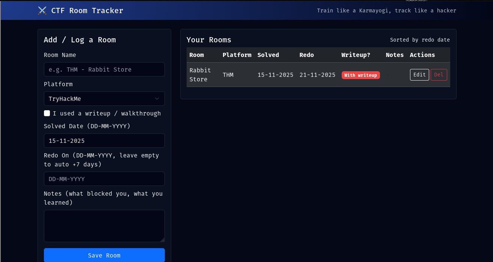

# 🧭 Room_Practice_tracker

---

## Description
This is flask app is built for keeping the track of your rooms that you have solved over THM/HTB/Cyberdefenders etc.

This tool helps you build consistency in CTF training.  
Every time you solve a room, you log:

- Platform (THM, HTB, Local, Other)
- Whether you used a writeup
- Date solved
- Auto-scheduled redo date (+7 days)
- Optional notes (what blocked you, what you learned)

---

## 🚀 Features

- Clean cyber-dark UI  
- DD-MM-YYYY date format  
- Automatic redo date: *solved date + 7 days*  
- Support for custom platforms (“Other”)  
- SQLite database (portable & simple)  
- Edit/Delete support  
- Fully responsive  
- Deployable anywhere: local, VPS, or Render  

---

# 📦 Installation (Local Machine)

### 1. Clone the repository
```bash
git clone https://github.com/YOUR_USERNAME/Room_Practice_Tracker.git
cd Room_Practice_Tracker
```
### 2. Create your Virtual Environment
```bash
python3 -m venv venv
source venv/bin/activate # For Liunx
venv\Scripts\activate   # For Windows
```
### 3. Install Dependecies
```bash
pip install -r requirements.txt
```
### 4. Run the app
```bash
python3 app.py
```
### 5. Visit on the Web
http://127.0.0.1:5000/

---
# Demo Image


